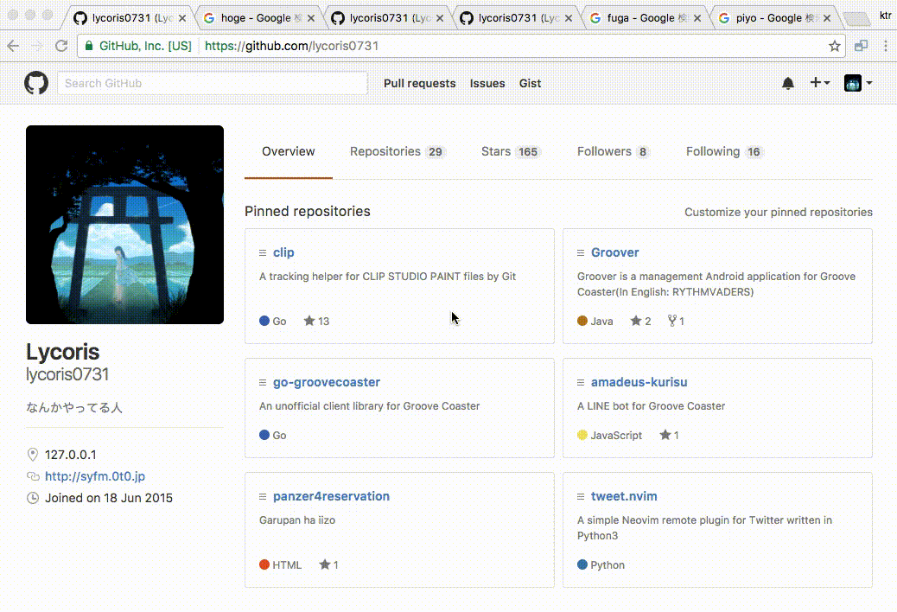

  
  
A Chrome extension for closing all tabs of duplicate URL

===

## Description  
When the icon was clicked, close all tabs which same URL with current tab's.  
  

## Equipments
- Chrome

## Installation
1. Download `excl.crx` from Release page.  
2. D&D it to extension settings page.
3. Done!

## License
Please see LICENSE.
